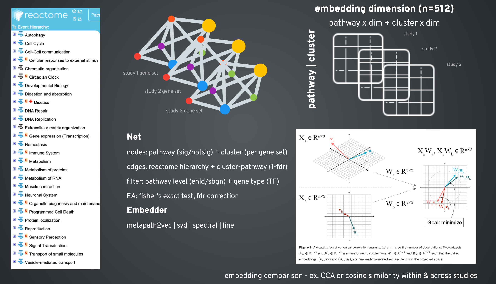

# gpath2vec

a python package for converting gene sets to biological pathway embeddings with enrichment analysis attributes.

gene sets (from clusters, niches, studies) are tested against reactome pathways via fisher's exact test, then embedded into a shared vector space using metapath2vec over the pathway hierarchy graph.



## pipeline

```
gene sets (per cluster/niche/study)
    |
    v
pathway filtering (level: high/mid/low, gene type: TF, etc.)
    |
    v
enrichment analysis (fisher's exact test, fdr correction)
    |
    v
EA matrix: cluster x pathway (1-fdr or odds ratio weights)
    |
    v
pathway hierarchy graph (reactome) + cluster nodes with EA edges
    |
    v
metapath2vec random walks (weighted, type-biased)
    |
    v
skipgram embeddings (default 512-d)
    |
    v
cluster x 512 embedding matrix
```

## the network

the `Net` class builds a heterogeneous networkx graph with two node types:

- **pathway nodes** (reactome stIds): the reactome homo sapiens pathway hierarchy
- **cluster nodes** (your gene lists of interest): added from enrichment results

and two edge types:

- **pathway - pathway**: parent-child relations from the reactome hierarchy
- **cluster - pathway**: weighted edges from enrichment analysis (1 - fdr or odds ratio). each cluster connects to its significantly enriched pathways.

genes are not in the graph. they are used upstream in the enrichment step to determine which pathways are significant, but only pathways and clusters appear as nodes.

pathway node attributes:

- `node_type`: "sig" or "notsig" (fdr < 0.05)
- `het`: 1 (sig), 0 (notsig), or -1 (not in enrichment results)
- `feature`: fdr value (raw)
- `features`: [1 - fdr] (inverted, used as weight)
- `stId`: reactome stable identifier
- `pathway_name`: human-readable name
- `parent_pathway`: top-level reactome category

cluster node attributes:

- `node_type`: "cluster"
- `cluster`: cluster name

cluster-pathway edge attributes:

- `weight`: enrichment score (1 - fdr or odds ratio)

the graph can be filtered by pathway level (high/mid/low) and by gene membership before construction. set `digraph=True` for a directed graph, `induce=True` to keep only significant pathways.

## the embeddings

metapath2vec performs biased random walks on the network, then trains a skipgram model to learn a dense vector for every node.

the walks are type-aware: metapaths like `[sig, notsig, sig]` or `[cluster, sig, sig]` guide the walker to follow specific node-type sequences. edge weights from the enrichment analysis bias which neighbors get visited, so clusters with strong signal to specific pathways walk there more often.

the result is a shared embedding space where:

- **pathway embeddings** (`pathway x dim`) capture where each pathway sits in the reactome hierarchy and how it relates to other pathways through enrichment patterns. pathways that are structurally close in reactome or co-enriched across clusters end up with similar vectors.
- **cluster embeddings** (`cluster x dim`) capture each cluster's biological function as a position in pathway space. two clusters with similar pathway enrichment profiles end up close together, but unlike the raw EA matrix, the embedding also encodes the hierarchical relationships between their enriched pathways. a cluster enriched in "FGFR2 alternative splicing" and one enriched in "signaling by FGFR" will be closer than two clusters enriched in unrelated pathways, even if neither shares the exact same significant pathway.
- **EA matrix** (`cluster x pathway`) is the interpretable complement to the embeddings. each row is a cluster's pathway activity profile with explicit scores (1 - fdr or odds ratio). it serves as ground truth for what the embeddings encode and can be used directly for comparison across studies via cosine similarity.

## outputs

- **EA matrix** (`cluster x pathway`): enrichment weights per cluster, available as 1 - fdr or odds ratio
- **cluster embeddings** (`cluster x dim`): one dense vector per cluster encoding pathway activity + graph structure
- **pathway embeddings** (`pathway x dim`): one dense vector per pathway encoding hierarchical position + enrichment context

## install

```bash
pip install -e .
```

## usage

### python

```python
from gpath2vec.ea import enrich, ea_matrix, filter_pathways
from gpath2vec.net import Net
from gpath2vec.embedder import PathwayMetapath2vec

# gene sets: dict of {name: [genes]}
gene_sets = {
    "cluster_0": ["EGFR", "EGF", "FGFR2", ...],
    "cluster_1": ["CD8A", "CD8B", "GZMB", ...],
}

# enrichment (filter to low-level pathways containing TF genes)
ea_df = enrich(gene_sets, level="low", gene_filter=tf_genes)
matrix = ea_matrix(ea_df, weight="fdr")       # cluster x pathway
matrix_or = ea_matrix(ea_df, weight="oddsratio")

# build graph with cluster nodes
clusters = {}
for _, r in ea_df[ea_df.sig_pathway].iterrows():
    clusters.setdefault(r["cluster"], {})[r["stId"]] = 1 - r["fdr_bh"]

enrichment = [{"stId": r["stId"], "entities": {"fdr": r["fdr_bh"]}}
              for _, r in ea_df.drop_duplicates("stId").iterrows()]

net = Net(enrichment=enrichment, id="my_study", digraph=True,
          level="low", gene_filter=tf_genes, clusters=clusters)

# embeddings (pick a method)
from gpath2vec.embedder import (
    PathwayMetapath2vec, SVDEmbedder, SpectralGraphEmbedder, LINEEmbedder
)

# metapath2vec: weighted random walks + skipgram on the graph
embedder = PathwayMetapath2vec(graph=net.graph, name="my_study",
                                walks_per_node=10, walk_length=100)
walks = embedder.model
embedder.train_embeddings(walks=walks, dimensions=512, epochs=15, lr=0.005)

# svd: truncated svd on the ea matrix (no graph, baseline)
embedder = SVDEmbedder(matrix, dimensions=512)

# spectral: laplacian eigenmaps on the graph (deterministic)
embedder = SpectralGraphEmbedder(net.graph, dimensions=512)

# line: first + second order proximity on the graph (weighted edges)
embedder = LINEEmbedder(net.graph, dimensions=512, epochs=15, lr=0.005)

embeddings = embedder.get_embeddings()
```

### cli

```bash
# enrichment
gpath2vec enrichment --genes "EGFR,EGF,FGFR2" --level low --out-path results.json

# network
gpath2vec network --enrichment-path results.json --level low --out-path net.pkl

# embeddings (default: metapath2vec)
gpath2vec embeddings --network-path net.pkl --dimensions 512 --out-path emb.pkl

# embeddings with alternative methods
gpath2vec embeddings --network-path net.pkl --method svd --ea-matrix-path ea_matrix.csv --out-path emb.pkl
gpath2vec embeddings --network-path net.pkl --method spectral --out-path emb.pkl
gpath2vec embeddings --network-path net.pkl --method line --out-path emb.pkl

# full pipeline with method choice
gpath2vec end2end --genes "EGFR,EGF" --level low --method line --output-dir output/
```

## embedding methods

| method | input | training | edge weights | deterministic |
|--------|-------|----------|-------------|---------------|
| metapath2vec | graph | skipgram on random walks | yes (biases walks) | no |
| svd | ea matrix | truncated svd | n/a (no graph) | yes |
| spectral | graph | laplacian eigenmaps | yes | yes |
| line | graph | first + second order proximity | yes (samples proportional) | no |

- **metapath2vec**: best for capturing heterogeneous graph structure (pathway hierarchy + cluster nodes). requires training.
- **svd**: baseline. operates on the ea matrix directly, no graph structure. fast, deterministic. if svd gives the same results as metapath2vec, the graph isn't adding signal.
- **spectral**: deterministic embedding from the graph laplacian. good comparison point for metapath2vec without training variance.
- **line**: handles edge weights more explicitly than metapath2vec. two objectives capture both local (direct neighbors) and global (shared neighbor) structure.

## pathway levels

pathway filtering uses reactome's own classification:

- **high**: pathways with enhanced high level diagrams (ehld)
- **mid**: pathways between ehld and sbgn
- **low**: pathways with sbgn diagrams (most specific)
- **all**: no filtering

## gene filtering

restrict the pathway universe to only pathways containing specific genes of interest (ex. transcription factors from pathway commons):

```python
# TF genes from pathway commons SIF (controls-expression-of)
ea_df = enrich(gene_sets, level="low", gene_filter=tf_genes)
```

## local caching

reactome data is downloaded once and cached to `~/.gpath2vec/cache/`. set `GPATH2VEC_REACTOME_DIR` to use a custom cache directory:

```bash
export GPATH2VEC_REACTOME_DIR=/path/to/reactome/files
```
