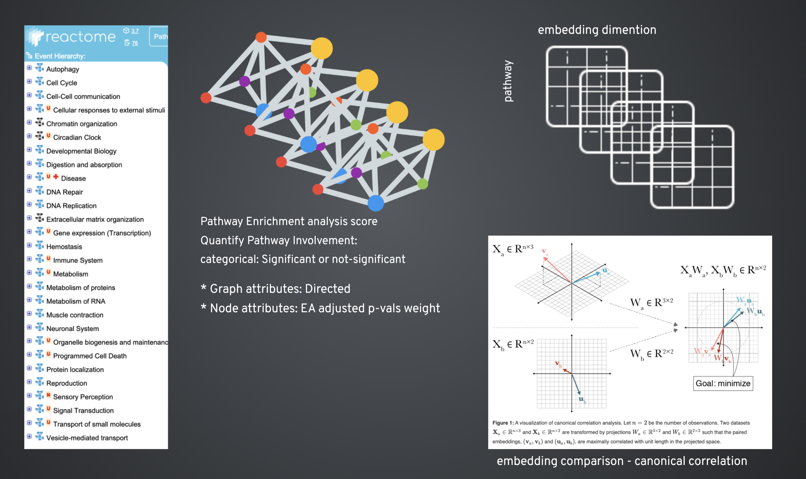

# gpath2vec
A Python package for converting gene-sets to biological pathways embeddings with enrichment analysis attributes.

### Features: 
1. Perform pathway enrichment analysis
2. Create pathway networks
3. Generate pathway embeddings
   
